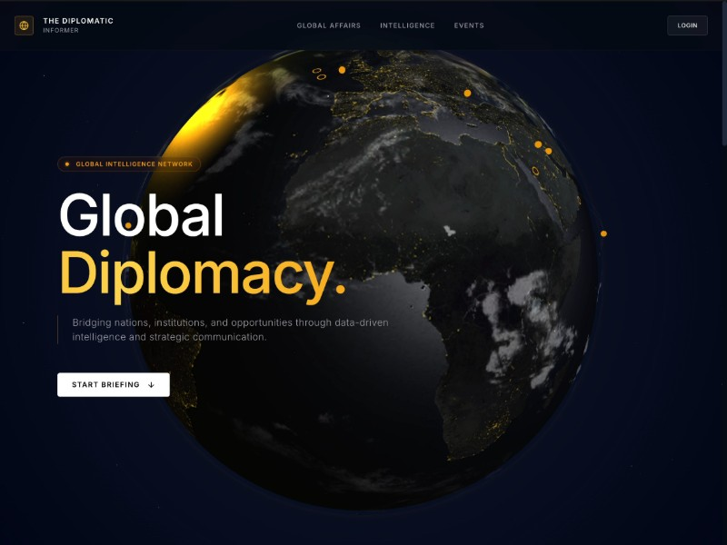

# The Diplomatic Informer — Global Diplomacy Landing Page

> Full reproduction and clone of the globe-driven template from [https://please-make-the-55.aura.build/](https://please-make-the-55.aura.build/).

A cinematic, dark-mode landing page built around an interactive 3D WebGL Earth globe, designed for diplomatic intelligence, global affairs platforms, think tanks, and strategic communication institutions.



---

## ✨ Features

- **Dark & Light Mode Switcher**:
  - Interactive Sun/Moon toggle in the navigation bar.
  - Automatic system preference detection and `localStorage` persistence.
  - **Dynamic 3D WebGL Scene Adaptation**:
    - **Light Mode**: Sunlit daytime Earth with vivid oceans and continents, sky azure atmospheric halo, calibrated ambient lighting, soft daylight background (`#F8FAFC`), and clean frosted white glass cards (`bg-white/80 border-slate-200`).
    - **Dark Mode**: Deep cosmic night with glowing golden city lights, amber atmospheric rim light, and 1,500 drifting stars.
- **Interactive 3D Earth (Three.js WebGL)**:
  - Multi-layer texturing (day/night surface, ocean specular reflections, normal bump mapping, golden city lights emissive texture, independent rotating cloud sphere layer).
  - Atmospheric glow custom shader with dynamic rim lighting.
  - Interactive mouse parallax that smoothly tilts the universe according to cursor position.
  - Drifting 3D starfield with 1,500 particles.
- **Inter-City Data Traffic**:
  - Accurate latitude/longitude to 3D Cartesian spherical coordinate mapping.
  - Quadratic Bezier 3D arc trajectories connecting global hubs (New York, London, Tokyo, Sydney, Rio de Janeiro, Dubai, Singapore, Paris, San Francisco, Mumbai).
  - Glowing amber city markers with pulsing animated data packet particles traveling along trajectories.
- **GSAP ScrollTrigger Camera Choreography**:
  - Smoothly pans, rotates, and frames the 3D globe as the user scrolls through each section:
    - **Hero Phase**: Centered majestic globe view with gold gradient headline.
    - **Borderless Connectivity Phase**: Panned to the right showcasing 196 monitored countries and 24/7 live updates.
    - **Predictive Intelligence Phase**: Panned to the left with algorithm and forecasting overview.
    - **Inner Circle Phase**: Cinematic zoom transition framing the email access capture.
- **Interactive UI Enhancements**:
  - Smooth anchor scrolling from navigation and hero CTA.
  - Interactive **Case Studies Modal** with geopolitical briefing previews.
  - Glassmorphic **Diplomatic Portal Login Modal**.
  - **Request Access** email submission form with interactive status feedback.
  - "Interactive Globe" button to trigger dynamic orbital spins.

---

## 🛠️ Tech Stack

- **HTML5 & CSS3** (Vanilla CSS + Tailwind CSS)
- **Three.js (r128)** — 3D WebGL scenes, materials, shaders, geometries
- **GSAP 3.12.2 & ScrollTrigger** — Timeline choreography & scroll scrubbing
- **Lucide Icons** — High-precision iconography
- **Vite 6** — Lightning-fast local development server & bundler

---

## 🚀 Getting Started

### 1. Run with Vite (Recommended)

```bash
# Install dependencies (already installed)
npm install

# Start development server
npm run dev
```

Open [http://localhost:5173](http://localhost:5173) in your browser.

### 2. Build for Production

```bash
npm run build
```

Preview the production build:
```bash
npm run preview
```

### 3. Or Run with Any Static Server

```bash
# Python
python3 -m http.server 8000

# Or npx serve
npx serve .
```

---

## 📂 Project Structure

```text
ai4bt-global-summit26/
├── index.html          # Main application with 3D canvas and narrative sections
├── public/             # Static public assets (Vite served)
│   ├── textures/       # High-res Earth surface, clouds, specular, lights textures
│   └── preview.jpeg    # Template preview image
├── textures/           # Local copy of planet textures for direct file serving
├── package.json        # Project scripts and dependencies
├── vite.config.js      # Vite configuration
├── preview.jpeg        # OG image / visual preview
└── README.md           # Documentation
```
